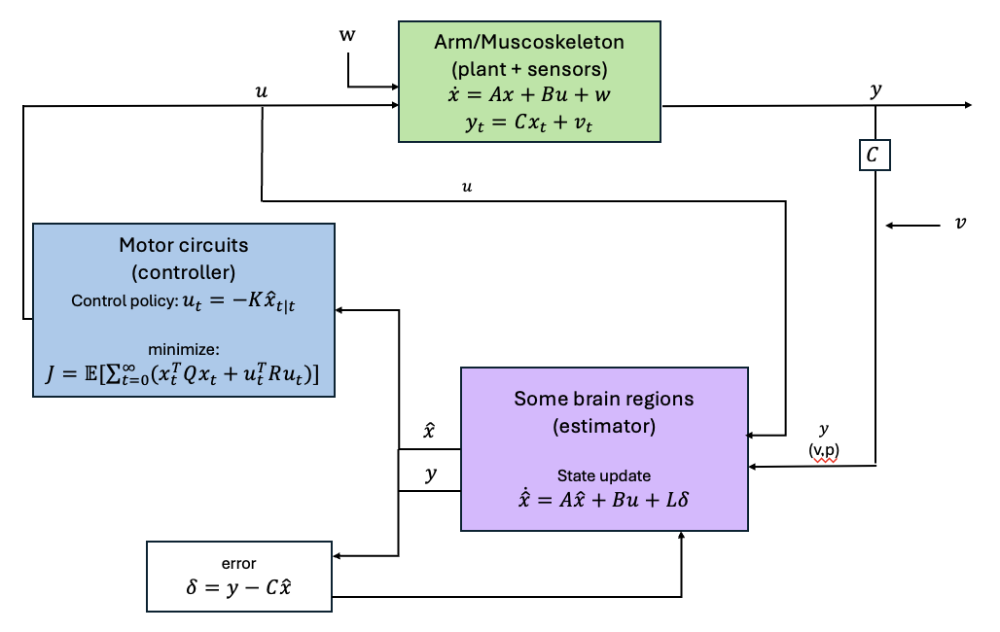
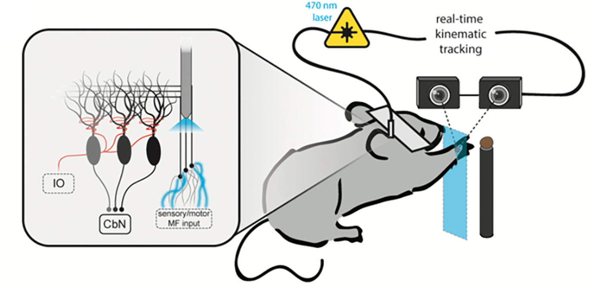
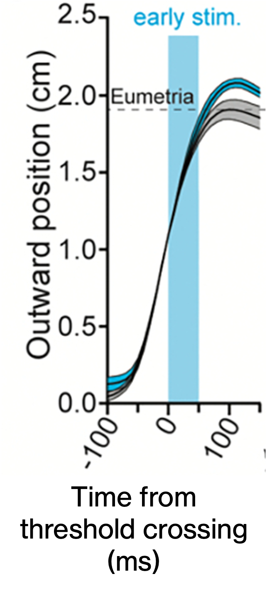
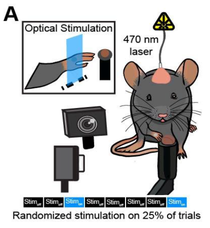
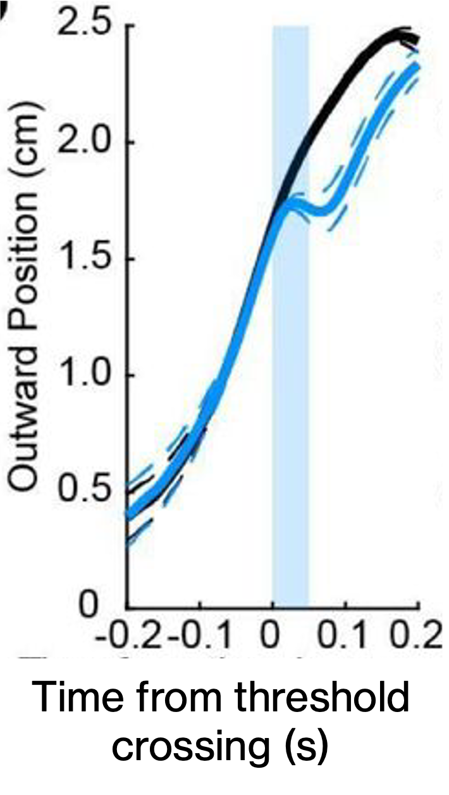

# cerebellar_LQG_control

This repo provides a linear quadratic Gaussian control model to model cerebellar pathways for motor movement control. The included notebooks simulate perturbations to cerebellar control and how the system responds to correct the perturbations. While this model demonstrates the corrective nature of the cerebellum, it does not allow learning.

## Environment set up
1. Clone repo to your local machine

    ```
    git clone https://github.com/emilyekstrum/cerebellar_LQG_control.git 
    ```

2. Create conda environment

    ```
    conda env create -f lqg_cerebellum_env.yml
    ```

3. Activate environment and select it for notebook use
    ```
    conda activate lqg_cerebellum_env.yml
    ```
* requires conda

## Repo organization

```  model/lqg_model.py ```: Linear quadratic Gaussian control model 

``` notebooks/*```: instantiate LQG models with various dimensions (1-10D)
 
 - perturb u (control command) and x_hat (internal state estimate)


## LQG Formulation



### System Dynamics

The continuous linear system is described by:

$$\dot{x}(t) = Ax(t) + Bu(t) + w(t)$$

$$y(t) = Cx(t) + v(t)$$

## Gaussian Noise 

Both noise processes are Gaussian:

$$w(t) \sim \mathcal{N}(0,\, Q_w)$$

$$v(t) \sim \mathcal{N}(0,\, R_v)$$

---

## LQG Cost Function

The LQG controller minimizes the quadratic cost:

$$J = \lim_{T \to \infty} \frac{1}{T}\,\mathbb{E}\!\left[\int_0^T \left(x^\top(t)\,Q\,x(t) + u^\top(t)\,R\,u(t)\right)dt\right]$$

---

## Separation Principle

The LQG solution solves two independent problems:

$${\text{LQG} = \text{LQR (optimal control)} + \text{Kalman Filter (optimal estimation)}}$$

---

## LQR (Linear Quadratic Regulator)

The optimal control law:

$$u(t) = -K\,x(t)$$

---

## Part 2 — Kalman Filter

The state estimate $\hat{x}(t)$ evolves as:

$$\dot{\hat{x}}(t) = A\hat{x}(t) + Bu(t) + L\!\left(y(t) - C\hat{x}(t)\right)$$


## Alignment with experimental studies

### 1. LQG model control command (x_hat) perturbation ~ mossy fiber perturbation

<div style="text-align: center;">


</div>


- Mossy fibers are associated with sending sensory feedback to the cerebellum, which is analogous to feedback in the LQG model that contributes to the calculation of the internal state estimate (x_hat).
- Optogenetic stimulation of mossy fiber activity is modeled by perturbing LQG x_hat, which results in movement errors that require several trials to be corrected.

Calame DJ, Becker MI, Person AL. Cerebellar associative learning underlies skilled reach adaptation. Nat Neurosci. 2023;26(6):1068-1079. doi:10.1038/s41593-023-01347-y


### 2. LQG model state estimate (u) perturbaion ~ anterior interposed (IntA) neurons

<div style="text-align: center;">


</div>

- Anterior interposed neurons that project to the red nucleus are associated with carrying motor commands from the cerebellum to cerebral areas. 
- Optogenetic stimulation of IntA activity is modeled by perturbing LQG u, which results in movement trajectory errors that can be corrected within the movement.


Dobrott CI, Becker MI, Person AL. Corrective sub-movements link feedback to feedforward control in the cerebellum. Preprint. bioRxiv. 2025;2025.08.01.668191. Published 2025 Aug 1. doi:10.1101/2025.08.01.668191


## LQG Terms

| Variable | Description | Biological Connection |
| -------- | -------- | -------- |
| x | True state | Real system position, velocity, etc |
| x_hat  | Hidden system state estimate   |  Cerebellum's internal copy/model of the muscoskeleton state (position, velocity, etc)
| u  | Control command  | Motor command sent to limbs |
| y   | Observations   | Visual and proprioceptive cues |
| y_hat   | Internal estimate of observations  | Cerebellar prediction of visual and proprioceptive cues |
| y_tilde   | Prediction error between y and y_hat | Difference in cerebellar predicted observations and real observations |
| v   | Measurement noise | Sensory input noise |
| w   | Process noise | Motor noise |
| A | System dynamics matrix | Describes how system/movement trajectory evolves linearly over time |
| B | Control input matrix; converts u into a state change | Describes how motor commands afect the system trajectory |
| C | Observation matrix | Describes how the hidden state (x_hat) produces sensory signals; maps the body state and sensory feedback |
| K | Optimal feedback gains matrix | Determines how strongly the controller/motor circuits reacts to errors |
| L | Kalman gains matrix | Describes how strongly the prediciton error influences the internal state estimate |
| Q | State error cost matrix | Penalizes deviations from target end position of movement trajectory |
| R | Control effor cost matrix | Penalizes large motor commands to prefer energy-efficient movements |


